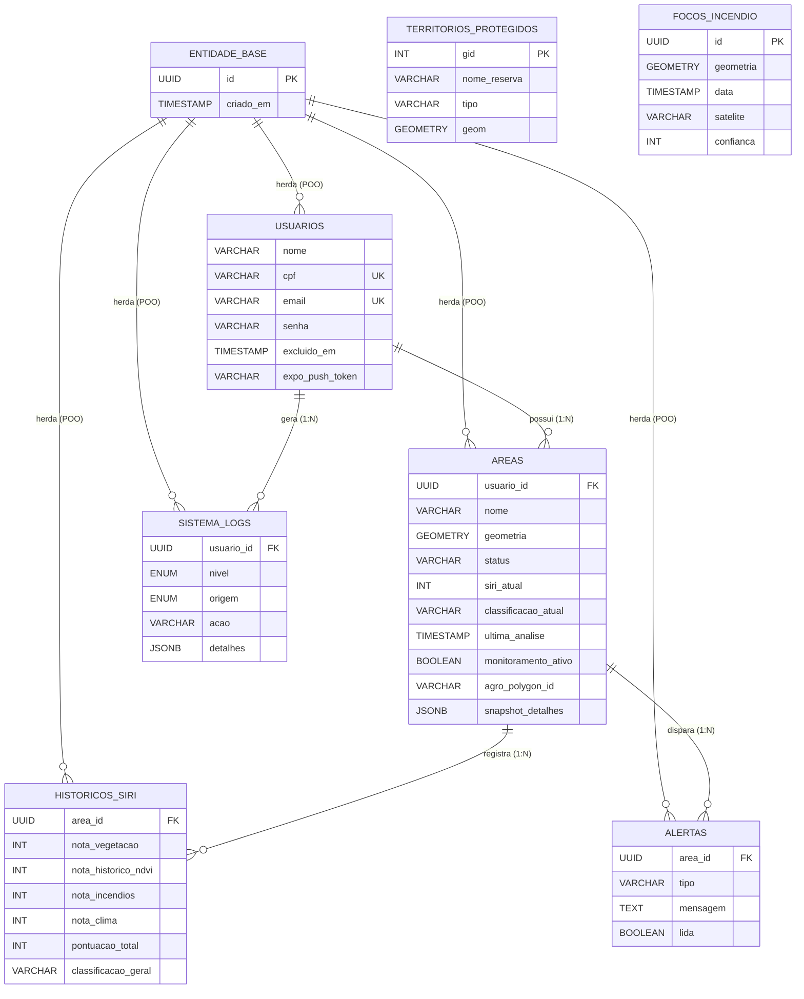

# Diagrama de Entidade-Relacionamento (MER)

```mermaid
erDiagram
    ENTIDADE_BASE {
        UUID id PK
        TIMESTAMP criado_em
    }

    USUARIOS {
        VARCHAR nome
        VARCHAR cpf UK
        VARCHAR email UK
        VARCHAR senha
        TIMESTAMP excluido_em
        VARCHAR expo_push_token
    }
    
    AREAS {
        UUID usuario_id FK
        VARCHAR nome
        GEOMETRY geometria
        VARCHAR status
        INT siri_atual
        VARCHAR classificacao_atual
        TIMESTAMP ultima_analise
        BOOLEAN monitoramento_ativo
        VARCHAR agro_polygon_id
        JSONB snapshot_detalhes
    }
    
    HISTORICOS_SIRI {
        UUID area_id FK
        INT nota_vegetacao
        INT nota_historico_ndvi
        INT nota_incendios
        INT nota_clima
        INT pontuacao_total
        VARCHAR classificacao_geral
    }
    
    ALERTAS {
        UUID area_id FK
        VARCHAR tipo
        TEXT mensagem
        BOOLEAN lida
    }
    
    SISTEMA_LOGS {
        UUID usuario_id FK
        ENUM nivel
        ENUM origem
        VARCHAR acao
        JSONB detalhes
    }

    TERRITORIOS_PROTEGIDOS {
        INT gid PK
        VARCHAR nome_reserva
        VARCHAR tipo
        GEOMETRY geom
    }

    FOCOS_INCENDIO {
        UUID id PK
        GEOMETRY geometria
        TIMESTAMP data
        VARCHAR satelite
        INT confianca
    }

    ENTIDADE_BASE ||--o{ USUARIOS : "herda (POO)"
    ENTIDADE_BASE ||--o{ AREAS : "herda (POO)"
    ENTIDADE_BASE ||--o{ HISTORICOS_SIRI : "herda (POO)"
    ENTIDADE_BASE ||--o{ ALERTAS : "herda (POO)"
    ENTIDADE_BASE ||--o{ SISTEMA_LOGS : "herda (POO)"

    USUARIOS ||--o{ AREAS : "possui (1:N)"
    AREAS ||--o{ HISTORICOS_SIRI : "registra (1:N)"
    AREAS ||--o{ ALERTAS : "dispara (1:N)"
    USUARIOS ||--o{ SISTEMA_LOGS : "gera (1:N)"
```