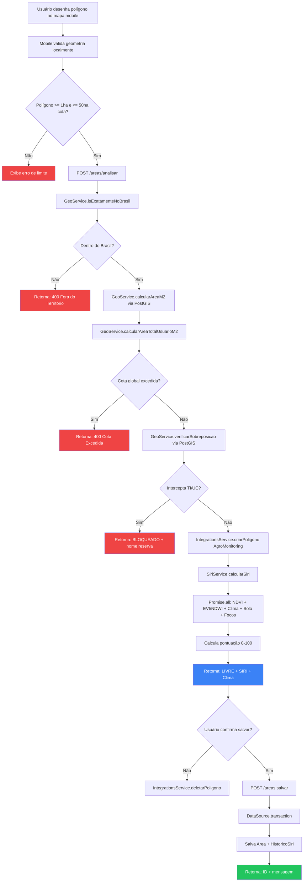
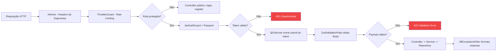
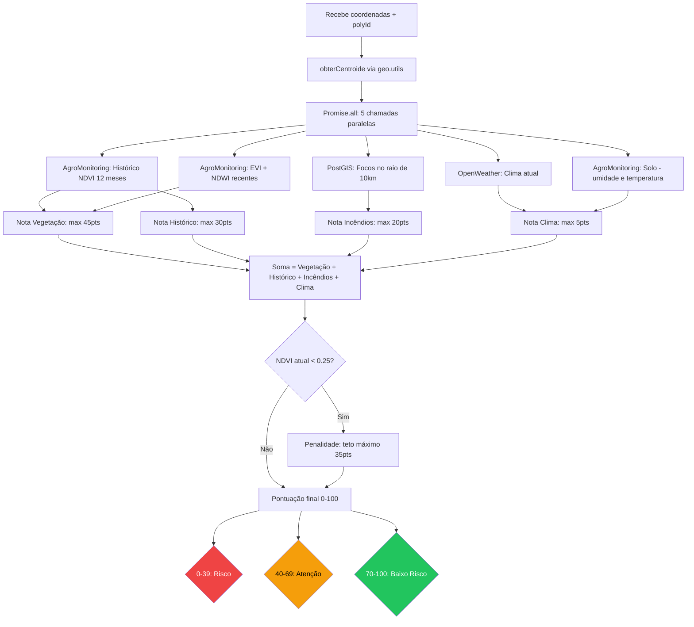

# Diagramas de Fluxo

## 1. Fluxo Principal — Triagem e Salvamento de Área

---

## 2. Fluxo de Monitoramento Contínuo — Cron Jobs

```mermaid
flowchart TD
    subgraph "Varredura SIRI Semanal - Domingo 00:00"
        A1["Busca áreas com monitoramento ativo"] --> B1["Para cada chunk de 3 áreas em paralelo"]
        B1 --> C1["Extrai coordenadas do GeoJSON"]
        C1 --> D1["SiriService.calcularSiri"]
        D1 --> E1["Atualiza status: NORMAL / ALERTA / EMERGENCIA"]
        E1 --> F1["Salva novo HistoricoSiri no banco"]
    end

    subgraph "Monitoramento Clima e Fogo - A cada hora"
        A2["Busca áreas monitoradas + usuario"] --> B2["Para cada chunk de 3 áreas em paralelo"]
        B2 --> C2["NASA FIRMS: Busca focos ativos 24h"]
        C2 --> D2{"Focos detectados?"}
        D2 -- Sim --> E2["Deduplica por coordenada + janela temporal"]
        E2 --> F2["Salva FocoIncendio + Cria Alerta INCENDIO"]
        F2 --> G2["Push Notification via Expo"]
        D2 -- Não --> H2["OpenWeather: Checa clima extremo"]
        H2 --> I2{"Temp > 35°C ou Umidade < 20%?"}
        I2 -- Sim --> J2["Cria Alerta CLIMA + Push Notification"]
        I2 -- Não --> K2["Área OK, sem alertas"]
    end

    subgraph "Garbage Collector - A cada hora"
        A3["Lista polígonos na API AgroMonitoring"] --> B3["Compara com polígonos salvos no banco"]
        B3 --> C3{"Órfão e criado há > 1 hora?"}
        C3 -- Sim --> D3["Deleta polígono da API"]
        C3 -- Não --> E3["Mantém"]
    end

    style G2 fill:#f59e0b,color:#000
    style J2 fill:#f59e0b,color:#000
    style F1 fill:#22c55e,color:#fff
```

---

## 3. Fluxo de Autenticação e Segurança

---

## 4. Fluxo do Cálculo SIRI

